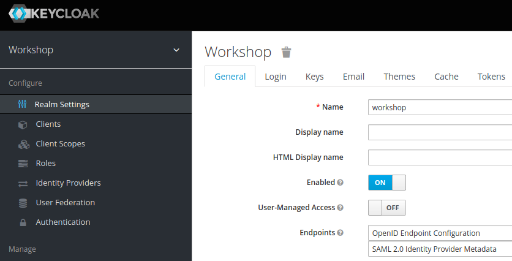

# Setup Keycloak as Identity Provider

For the last lab we will use [Keycloak](https://keycloak.org) by JBoss/RedHat as local identity provider.  
[Keycloak](https://keycloak.org) is [certified for OpenID Connect 1.0](https://openid.net/developers/certified/) and 
implements OAuth 2.0 and OpenID Connect 1.0.

## Setup Keycloak

You need a compliant OAuth 2.0 / OpenID Connect provider for this workshop.
Here we will use [Keycloak](https://keycloak.org) by RedHat/JBoss.

To set up Keycloak you have 2 options:

1. Run Keycloak using Docker (if you have Docker installed)
2. Local Keycloak installation & configuration

In this case we will use the docker option.

### Using Docker

If you have Docker installed then setting up Keycloak is quite easy.

To configure and run Keycloak using docker

1. Open a new command line terminal window
2. Change directory to subdirectory _setup_ of the workshop repository
3. Open and edit the script _run_keycloak_docker.sh_ or _run_keycloak_docker.bat_ (depending on your OS) and adapt the value for _WORKSHOP_HOME_ to your local workshop repository directory
3. Save and execute the script _run_keycloak_docker.sh_ or _run_keycloak_docker.bat_ (depending on your OS)

Wait until the docker container has been started completely. When you see the line _Started 590 of 885 services_, 
then Keycloak is configured and running.  
Now open your web browser and navigate to [localhost:8080/auth/admin](http://localhost:8080/auth/admin) and login
using the credentials _admin_/_admin_.

If you see errors importing the workshop configuration then please re-check the value of the _WORKSHOP_HOME_ environment variable (step 2 above) so that the script can find the _keycloak_realm_workshop.json_ file to import.

## Open Keycloak Admin UI

Independent of the setup type (docker or local install), to access the web admin UI of Keycloak 
you need to perform these steps:

1. Now direct your browser to [localhost:8080/auth/admin](http://localhost:8080/auth/admin/)
2. Login into the admin console using __admin/admin__ as credentials

Now, if you see the realm _workshop_ on the left then Keycloak is ready to use it for this workshop.

### Further Information

If you want to know more about setting up a Keycloak server for your own projects 
then please consult the [keycloak administration docs](https://www.keycloak.org/docs/latest/server_admin/index.html).